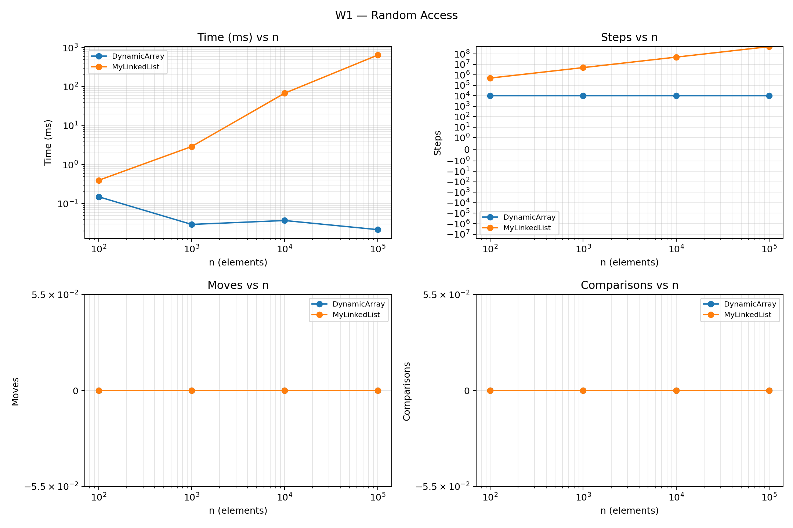
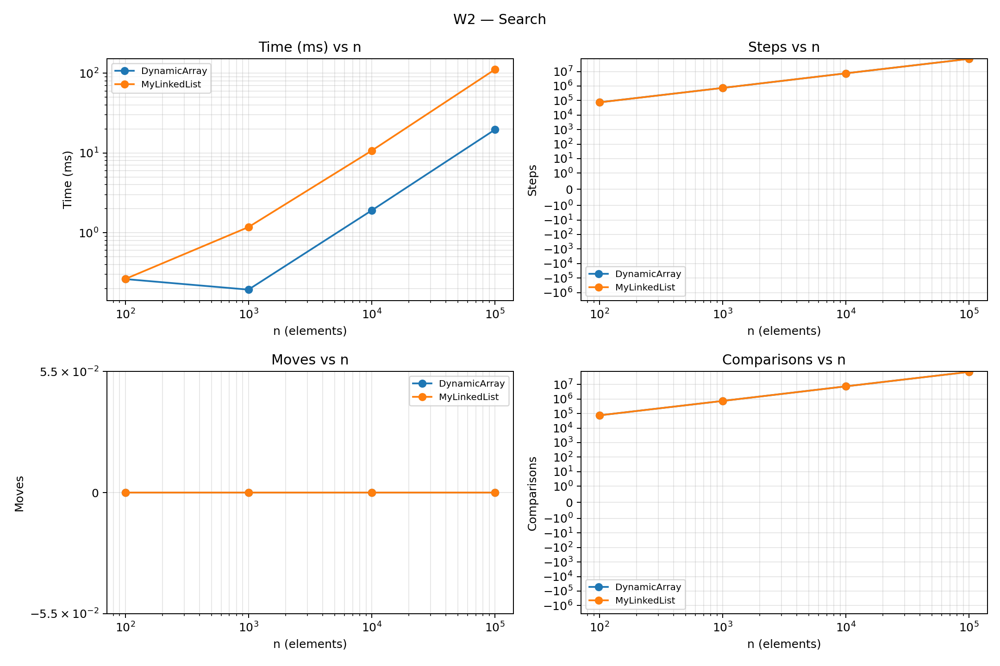
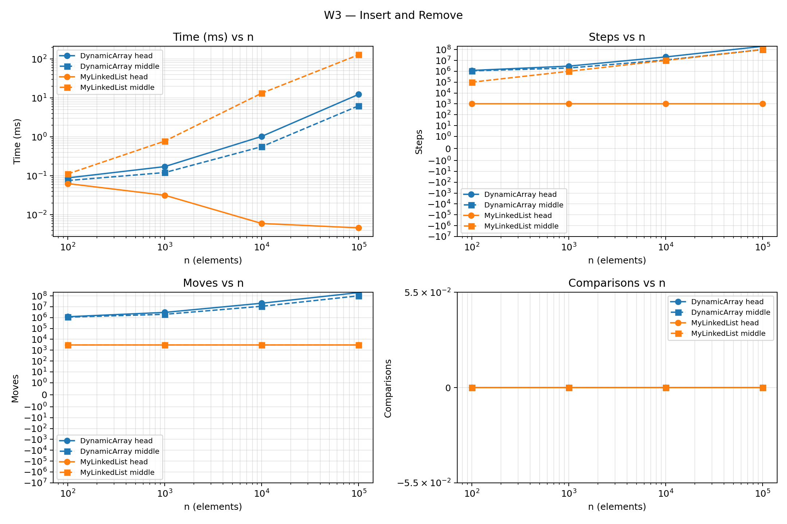
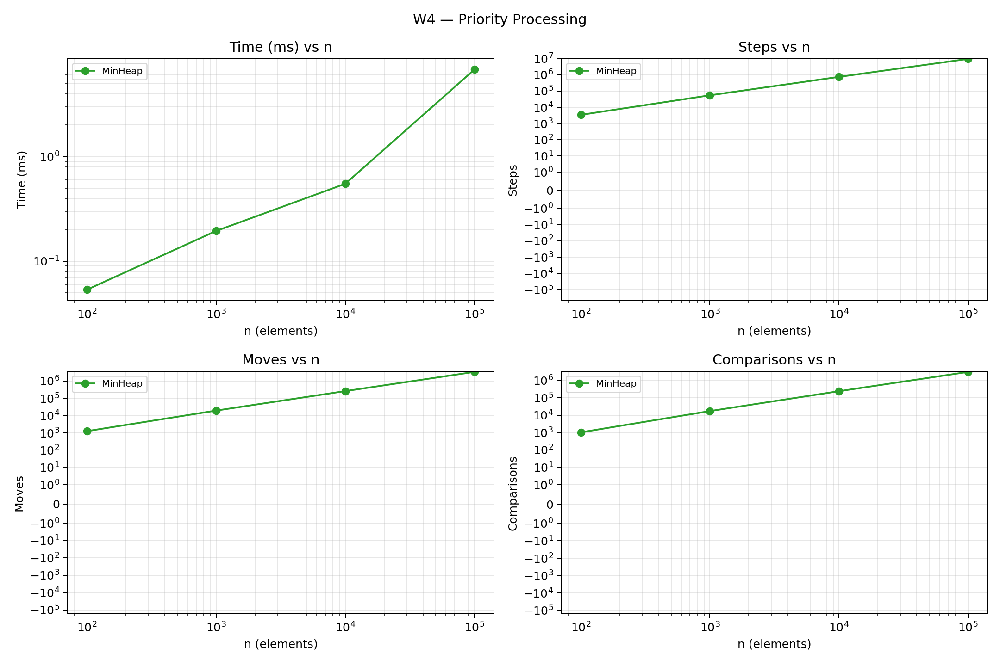

# Assignment 2 — DAA
**Student:** Myrzabekov Rakhat  
**Group:**SE-2518
## 1. Implementation and Methodology

The project implements DynamicArray, MyLinkedList and MinHeap from
scratch. All stored values are primitive int values. DynamicArray
and MinHeap use int arrays. MyLinkedList uses nodes containing an
int value and a next reference.

DynamicArray and MyLinkedList implement the same IntList interface.
The linked list is singly linked and maintains both head and tail.
The arrays double their capacity when full and do not shrink after
removal.

Metrics are counted inside the operations:

- A step is an array-cell read or a traversal through a next reference.
- A move is a relocation of an existing array element or an assignment
  to a structural list reference: head, tail or next.
- A comparison compares two element values.

Array resizing counts both reads and element relocations. A heap swap
counts two reads and two moves. Initial storage of a new array value
does not count as relocation. Index checks, loop conditions and local
variable assignments do not count as element comparisons or moves.
Heap validation does not modify the counters.

## 2. Complexity Analysis

Let n be the number of stored elements and i a valid index.
Average indexed-operation bounds assume uniformly selected valid
indices. Average search bounds assume a mixture of successful and
unsuccessful queries, with successful positions distributed across
the structure. Heap average upper bounds do not assume a particular
distribution of priorities.

Auxiliary space means temporary space used by an operation,
excluding the structure's existing storage.

| Structure | Operation | Best | Average | Worst | Auxiliary space | Justification |
|---|---|---|---|---|---|---|
| DynamicArray | add(x) | Θ(1) | Θ(1) amortized | Θ(n) | Θ(1), Θ(n) during growth | Usually writes one value; growth copies n values, but doubling gives linear total copying across a sequence of additions. |
| DynamicArray | add(i, x) | Θ(1) | Θ(n) | Θ(n) | Θ(1), Θ(n) during growth | Shifts n-i values; inserting at the end is constant when capacity is available. |
| DynamicArray | remove(i) | Θ(1) | Θ(n) | Θ(n) | Θ(1) | Shifts n-i-1 values; removing the last value needs no shifts. |
| DynamicArray | get(i) | Θ(1) | Θ(1) | Θ(1) | Θ(1) | Reads one array cell using its index. |
| DynamicArray | contains(x) | Θ(1) | Θ(n) | Θ(n) | Θ(1) | Stops at the first match or examines every stored value. |
| MyLinkedList | add(x) | Θ(1) | Θ(1) | Θ(1) | Θ(1) | The tail reference allows direct appending with one new node. |
| MyLinkedList | add(i, x) | Θ(1) | Θ(n) | Θ(n) | Θ(1) | Head and tail insertion are constant; other positions require traversal to the previous node. |
| MyLinkedList | remove(i) | Θ(1) | Θ(n) | Θ(n) | Θ(1) | Head removal is constant; other positions require finding the previous node. |
| MyLinkedList | get(i) | Θ(1) | Θ(n) | Θ(n) | Θ(1) | Makes i next-reference traversals from head. |
| MyLinkedList | contains(x) | Θ(1) | Θ(n) | Θ(n) | Θ(1) | Examines nodes until a match or the end. |
| MinHeap | insert(x) | Θ(1) | O(log n) amortized | Θ(n) | Θ(1), Θ(n) during growth | Bubble-up takes at most the tree height; an individual resizing insertion also copies n values. |
| MinHeap | peekMin() | Θ(1) | Θ(1) | Θ(1) | Θ(1) | Reads the root at index zero. |
| MinHeap | extractMin() | Θ(1) | O(log n) | Θ(log n) | Θ(1) | Bubble-down can stop immediately or descend through the tree height. |
| All structures | size(), getMetrics() | Θ(1) | Θ(1) | Θ(1) | Θ(1) | Return stored fields directly. |
| MinHeap | isValidHeap() | Θ(1) | O(n) | Θ(n) | Θ(1) | A test helper that checks parent-child relations and can stop on a violation. |

The MinHeap average bounds are upper bounds rather than tight Θ
claims because the priority distribution is not specified. Without
resizing, insert has worst-case Θ(log n). Over a sequence of
insertions, resizing adds only amortized Θ(1) work per insertion.

Each structure uses Θ(n) total storage. MyLinkedList additionally
requires a node object and reference for each value. Empty searches
take Θ(1), and invalid-input checks take Θ(1) before throwing.

## 3. Loop Invariant Proofs

### 3.1. DynamicArray.contains(value)

**Invariant:** Before iteration i, every element in data[0..i-1]
has been checked and none equals value. The structure is unchanged.

**Initialization:** Before the first iteration, i = 0. The checked
prefix is empty, so the statement is true.

**Maintenance:** The method reads data[i] and compares it with value.
If they are equal, it returns true, which is correct because a
matching element has been found. Otherwise, the checked prefix
extends by one element. After i increases, all elements before the
next index have been checked and are different from value.

**Termination:** The loop either returns true on a match or reaches
i = size. In the latter case, the invariant states that every stored
element has been checked and none equals value, so returning false
is correct. The index increases on each iteration, so the loop ends.

**Conclusion:** The method returns true exactly when a stored value
matches the query. It does not modify the array or its size.

### 3.2. DynamicArray.remove(index)

Let A be the original array contents and s the original size.
The method first validates index and saves A[index] as removed.

**Invariant:** Before each shift iteration i:

1. The size field still equals s.
2. Positions before index contain their original values.
3. For every k with index <= k < i, data[k] = A[k+1].
4. For every k with i <= k < s, data[k] = A[k].

**Initialization:** The loop starts with i = index. No values have
been shifted, so the shifted interval is empty and all original
positions remain unchanged.

**Maintenance:** The assignment data[i] = data[i+1] copies A[i+1]
into position i because the unprocessed suffix is unchanged.
Positions already shifted and positions before index are preserved.
After i increases, the shifted interval contains one more correct
value, so the invariant remains true.

**Termination:** The loop ends when i = s-1. Every position from
index through s-2 now contains the original next value. The method
decreases size to s-1, so the old last cell is outside the logical
array. The loop index increases each time, ensuring termination.

**Conclusion:** Exactly A[index] is removed, all remaining values
keep their order, and the saved removed value is returned. Validation
ensures that the operation starts with a valid index.

## 4. Benchmark and Plots

The benchmark uses n = 100, 1000, 10000 and 100000. Input values
are generated with new Random(42). Both list structures receive
identical values, access indices, search queries and insertion values.

Each case runs twice for warm-up, followed by five measured runs.
The median measured time and its associated counters are exported.
Inputs are deterministic, so operation counts are identical across
repetitions of the same case.

W1 performs 10000 random get calls. W2 performs 1000 contains calls:
500 present queries and 500 absent queries. Stored values are
nonnegative, while absent queries are negative.

W3 performs 1000 insertions followed by 1000 removals. The head
variant uses index zero. The middle variant uses the fixed index
n/2, where n is the initial size.

For W1-W3, initial filling is excluded from timing and counters.
For W4, both n insertions and n extractions are measured. Output
validation happens after the timer stops. Timing includes the small
benchmark-loop overhead and enabled operation counters.

Each figure contains time, steps, moves and comparisons versus n.
The time axes are logarithmic. Counter axes use a symmetric
logarithmic scale so zero values remain visible.

### W1 — Random Access

DynamicArray performs exactly 10000 steps for every size.
MyLinkedList performs 504930938 traversals at n = 100000.
At that size, measured times are 0.021625 ms for DynamicArray
and 644.034584 ms for MyLinkedList.

### W2 — Search

At n = 100000, both structures perform 73682044 element
comparisons. Their measured times are 19.574709 ms for
DynamicArray and 111.179209 ms for MyLinkedList.

The list reports 500 fewer steps than comparisons because each
successful query returns before moving to the next node. The 500
unsuccessful queries traverse past the last node to null.

### W3 — Insert and Remove

For head operations, MyLinkedList reports 1000 steps and 3000
reference updates at every size. At n = 100000, it takes
0.004625 ms, while DynamicArray takes 12.368000 ms and performs
200999000 element moves.

For middle operations at n = 100000, MyLinkedList takes
128.667917 ms and makes 100000000 traversals. DynamicArray takes
6.292500 ms and performs 100999000 element moves. The array
remains faster despite substantial shifting.

### W4 — Priority Processing

At n = 100000, MinHeap completes insertion and extraction in
6.775708 ms. It reports 9538439 steps, 3320189 moves and
3059125 comparisons. The benchmark checks that extracted values
are in non-decreasing order and the heap is empty afterwards.

## 5. Discussion
DynamicArray accesses an element directly by index, while
MyLinkedList must traverse nodes from head.
Array values occupy consecutive memory locations.
A CPU cache line can load several nearby integers together,
improving sequential scanning through spatial locality.
List traversal involves pointer chasing, where the next address
depends on reading the current node.
Node objects also require headers and references, increasing
memory usage compared with primitive arrays.
Creating and removing nodes can add allocation and garbage
collection costs.
In W2 at n = 100000, both structures perform the same number of
comparisons, but the list takes about 5.68 times longer.
This result is consistent with locality and traversal costs,
although cache misses were not measured directly.
MyLinkedList is useful for frequent head insertions and removals,
which require a constant number of link updates.
For middle operations, the array is faster in these measurements
because the list must traverse many nodes.
MinHeap is useful for priority scheduling because it provides
constant-time minimum access and logarithmic heap adjustment.
Small-size timing variations can result from JVM compilation
and measurement noise, and two warm-up runs may not fully
stabilize execution.

## 6. Testing

JUnit 5 tests cover empty structures, one element, duplicate values,
boundary indices and invalid indices. Random list operations are
compared against ArrayList in tests only.

Heap tests compare output against PriorityQueue, verify the heap
property after every insert and extraction, and check sorted output.
They also cover negative values and the minimum and maximum int
values. A DynamicArray test checks exact operation counts.

No standard collection is used to implement the three structures.